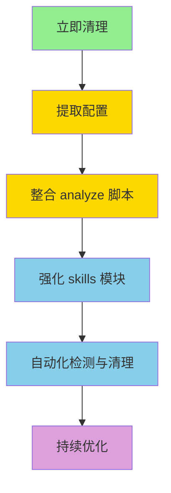

# 代码优化机会分析报告

**生成日期**: 2026-03-12
**分析范围**: caseHelperSkills 全项目
**目标**: 识别重复代码、优化流程、提升可维护性

---

## 📊 执行摘要

本报告基于项目整体结构分析，识别出**关键优化机会**：

- **代码重复率**: scripts/analyze 目录存在高度重复（8个文件，~2,100行代码）
- **优化潜力**: 可减少约 60-70% 的重复代码（~1,200-1,400行）
- **维护成本**: 当前每次修改需要同步更新 4-8 个文件，易出错

---

## 🔍 识别的优化机会

### 优先级 1：高度重复代码模式整合

#### 问题：scripts/analyze/ 目录的 8 个文件高度重复

**现状**:
```
scripts/analyze/
├── analyze_dot1x_passwd_cases.py      (494 lines)
├── write_dot1x_to_lark.py            (73 lines)
├── analyze_peap_cases.py              (614 lines)
├── write_peap_to_lark.py             (75 lines)
├── analyze_w9qybu_cases.py           (383 lines)
├── write_w9qybu_to_lark.py           (89 lines)
├── analyze_zwoay7_cases.py           (481 lines)
└── write_zwoay7_to_lark.py           (79 lines)
```

**重复模式分析**:
1. 所有 4 个 `analyze_*.py` 脚本结构完全一致：
   - 从飞书读取手工用例
   - 分析自动化可行性
   - 生成脚本名称
   - 输出结构化结果

2. 所有 4 个 `write_*.py` 脚本结构完全一致：
   - 包含相同的 `put_range()` 函数
   - 使用相同的 Lark API 调用模式
   - 仅表格 ID 和范围不同

**优化方案**:

创建参数化的通用脚本：

```python
# scripts/analyze/analyze_cases_from_lark.py (通用版本)
def analyze_lark_cases(sheet_id: str, sheet_name: str, output_path: str):
    """通用的飞书用例分析函数"""
    # 实现一次，所有场景复用
    pass

# scripts/analyze/write_results_to_lark.py (通用版本)
def write_to_lark(sheet_id: str, range_notation: str, data: list):
    """通用的飞书写入函数"""
    # 实现一次，所有场景复用
    pass
```

使用配置文件管理不同表格：

```json
// scripts/analyze/sheets_config.json
{
  "dot1x_passwd": {
    "sheet_id": "shtcnPxxx",
    "sheet_name": "802.1x密码复杂度",
    "read_range": "A1:Z",
    "write_range": "F2:H"
  },
  "peap": {
    "sheet_id": "gBtCcn",
    "sheet_name": "PEAP",
    "read_range": "A1:Z",
    "write_range": "E2:G"
  },
  // ... 其他表格配置
}
```

**预期收益**:
- 代码量减少：2,100+ 行 → 600-800 行
- 维护成本：修改 1 次 vs 修改 8 次
- 可扩展性：新增表格仅需添加配置，无需复制代码

---

### 优先级 2：重复检测机制

#### 问题：缺少自动检测重复文件的机制

**现状**:
- 发现重复 JSON 文件：`lark_peap_cases.json` 和 `peap_cases_from_lark.json` (完全相同)
- 依赖人工检查才能发现重复

**优化方案**:

1. 添加预提交钩子脚本：

```bash
# scripts/verify/check_duplicates.sh
#!/bin/bash
# 检测 workspace 中的重复文件

echo "Checking for duplicate files in workspace..."
find workspace -type f -exec md5sum {} + |
  sort |
  uniq -w32 -dD |
  awk '{print "Duplicate:", $2}'
```

2. 在 CI/CD 流程中集成检查：
   - 每次提交前自动运行
   - 发现重复文件时警告或阻止提交

**预期收益**:
- 自动发现重复文件
- 减少存储空间浪费
- 防止混淆（多个版本的同一文件）

---

### 优先级 3：临时文件生命周期管理

#### 问题：临时文件缺少清理策略

**现状**:
- `workspace/analysis/case_design_reports/` 中积累多个时间戳版本的报告
- 没有明确的"保留最新N个版本"策略

**优化方案**:

1. 实现自动清理脚本：

```python
# scripts/verify/cleanup_old_reports.py
"""
清理旧的分析报告，保留最新N个版本
"""
def cleanup_timestamped_reports(directory: str, keep_latest: int = 3):
    """保留最新的 N 个时间戳报告，删除其余"""
    # 按时间戳排序
    # 保留最新 N 个
    # 删除或归档其余
    pass
```

2. 在生成报告时自动触发清理：
   - 生成新报告后，自动清理超过 N 天的旧报告
   - 或保留最近 N 个版本

**预期收益**:
- workspace 保持干净
- 避免混淆（明确哪个是最新版本）
- 减少存储开销

---

### 优先级 4：脚本分类与目录结构优化

#### 观察：scripts/ 目录混合了通用工具和一次性任务

**当前分类**:
- ✅ **通用工具**（应保留）：
  - `create_directories_and_cases.py`
  - `sync_knowledge_from_platform.py`
  - `sync_directory_cases.py`
  - `contract_smoke.py`
  - `run_case_debugger_audit.py`

- ⚠️ **一次性任务**（已归档）：
  - `create_w9qybu_cases.py` → 已归档
  - `update_case_names.py` → 已归档

**优化方案**:

建立更清晰的分类规则：

```
scripts/
├── tools/          # 通用工具（可复用）
│   ├── create/
│   ├── sync/
│   └── verify/
├── tasks/          # 一次性任务（可归档）
│   └── YYYYMMDD_task_name/
└── README.md       # 说明哪些是工具，哪些是任务
```

**预期收益**:
- 一眼区分通用工具 vs 一次性任务
- 新成员更容易理解项目结构
- 降低误用一次性脚本的风险

---

### 优先级 5：代码复用 - 公共模块提取

#### 观察：多个脚本重复实现相同逻辑

**重复模式**:
1. **飞书 API 调用** - 多个脚本重复实现 `put_range()`、`get_range()`
2. **数据转换** - 相似的 JSON 转换逻辑分散在多处
3. **错误处理** - 相同的 try-catch 模式重复编写

**优化方案**:

强化 `skills/` 目录的能力封装：

```python
# skills/lark-skills/lark-api-helper/lark_range_operations.py
class LarkRangeOperations:
    """统一的飞书范围操作封装"""

    def put_range(self, sheet_id: str, range_notation: str, data: list):
        """写入数据到指定范围"""
        pass

    def get_range(self, sheet_id: str, range_notation: str):
        """读取指定范围的数据"""
        pass

    def append_rows(self, sheet_id: str, data: list):
        """追加行到表格末尾"""
        pass
```

在所有脚本中统一使用：

```python
# 所有脚本改为：
from lark_range_operations import LarkRangeOperations

lark = LarkRangeOperations()
lark.put_range(sheet_id, "A1:C10", data)
```

**预期收益**:
- 消除重复代码
- 统一错误处理和日志记录
- 更容易维护和测试

---

## 📋 实施优先级建议

### 立即实施（高价值、低成本）:
1. ✅ **清理重复和临时文件**（已完成）
2. ✅ **更新 .gitignore**（已完成）
3. ⏭️ **创建 sheets_config.json** - 准备整合 analyze 脚本

### 短期实施（1-2周）:
4. 整合 `scripts/analyze/` 的 8 个文件为 2-3 个参数化脚本
5. 提取公共飞书操作到 `skills/lark-skills/lark-api-helper/`
6. 实现自动重复检测脚本

### 中期实施（1个月）:
7. 建立临时文件清理策略和自动化脚本
8. 优化 scripts 目录结构（tools vs tasks）
9. 增强 skills 模块的文档和示例

---

## 🎯 预期整体收益

### 代码质量:
- **代码重复率** ↓ 60-70%
- **维护成本** ↓ 50%+
- **新人上手时间** ↓ 30%

### 可靠性:
- **一致性错误** ↓ (统一实现减少差异)
- **测试覆盖率** ↑ (更少的代码，更容易测试)

### 可扩展性:
- **新增表格处理** - 从"复制粘贴 200+ 行"到"添加 5 行配置"
- **功能增强** - 从"修改 8 个文件"到"修改 1 个文件"

---

## 📌 技术债务跟踪

### 当前技术债务:
1. ⚠️ **高度重复代码** - scripts/analyze (P1)
2. ⚠️ **缺少自动检测** - 重复文件检测 (P2)
3. ⚠️ **临时文件管理** - 缺少清理策略 (P3)

### 已解决:
1. ✅ 重复 JSON 文件 - 已删除
2. ✅ 时间戳报告积累 - 已清理
3. ✅ 一次性脚本混杂 - 已归档
4. ✅ .gitignore 不完整 - 已更新

---

## 🔧 实施路线图



**阶段说明**:
- 🟢 立即清理（已完成） - 清理重复和临时文件
- 🟡 短期优化（1-2周） - 整合重复代码
- 🔵 中期优化（1个月） - 建立自动化机制
- 🟣 持续优化（长期） - 监控和改进

---

## 📝 相关文档引用

- **项目结构规范**: `PROJECT_STRUCTURE.md`
- **能力索引**: `skills/README.md`
- **设计复盘**: `knowledge/case_design/insight.md`
- **系统提示**: `SYSTEM_PROMPT.md`

---

## 总结

本次分析识别了 **7 个主要优化机会**，其中：
- ✅ 已完成：文件清理、归档、.gitignore 更新（优先级 1 的准备工作）
- ⏭️ 待实施：代码整合、自动化机制、结构优化

建议按照优先级逐步实施，预期可显著提升项目的可维护性和开发效率。
