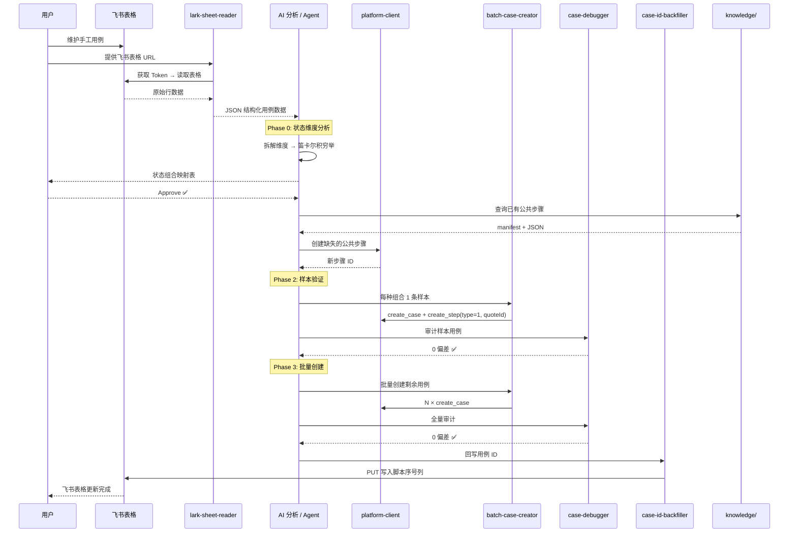
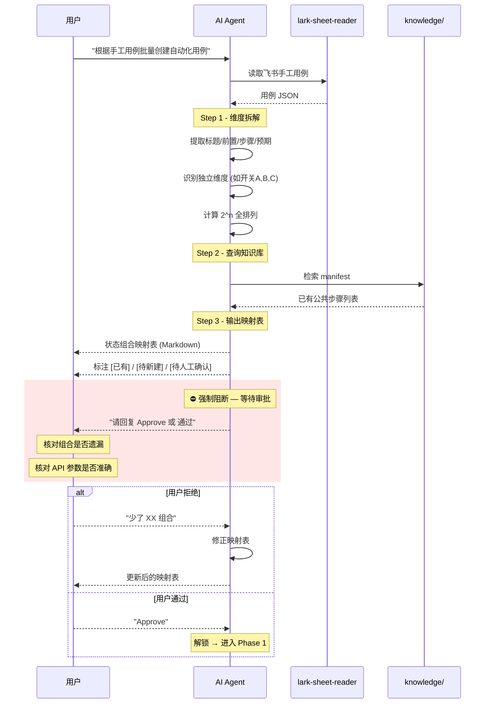
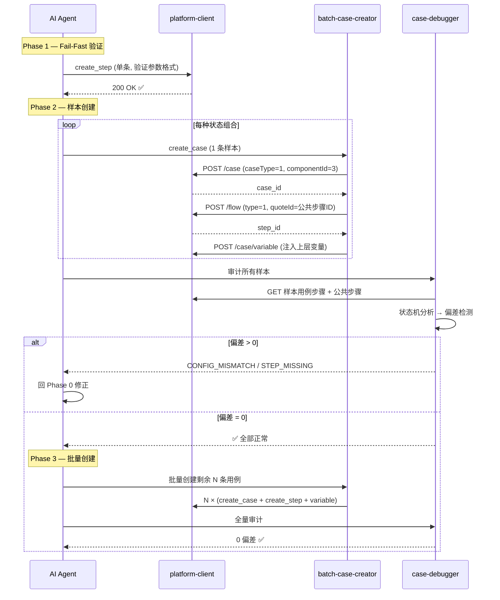
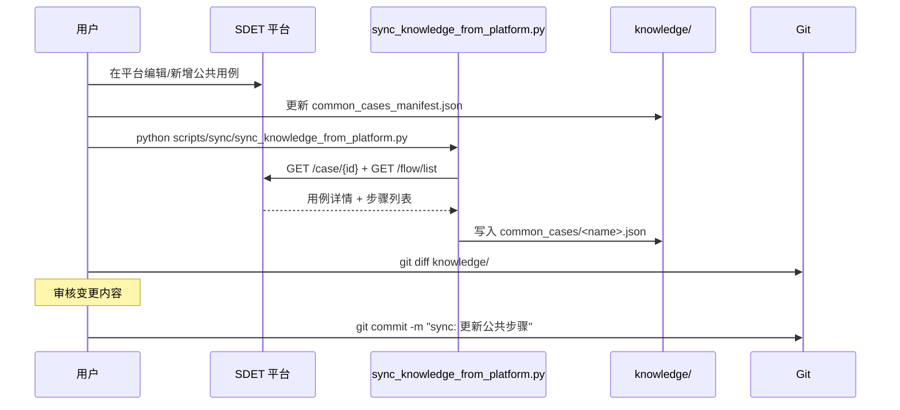

# caseHelper — SDET 自动化用例管理工具

> 从飞书手工用例表格到 SDET 平台自动化用例的全链路管理工具，集成 AI 辅助分析、批量创建、质量审计与双向同步能力。

---

## 目录

- [项目定位](#项目定位)
- [核心能力一览](#核心能力一览)
- [端到端工作流](#端到端工作流)
- [能力边界与 SOP 约束](#能力边界与-sop-约束)
- [时序图](#时序图)
  - [全链路视角](#1-全链路视角从飞书到平台)
  - [Phase 0 人工审批视角](#2-phase-0-人工审批阻断视角)
  - [批量创建视角](#3-批量创建与审计视角)
  - [知识库同步视角](#4-知识库同步视角)
- [快速开始](#快速开始)
- [项目结构](#项目结构)
- [API 注意事项](#api-注意事项)

---

## 项目定位

SDET 自动化用例管理的痛点：

| 痛点 | 解决方式 |
|------|---------|
| 手工用例在飞书表格，自动化用例在 SDET 平台，两边脱节 | 飞书读写 + 平台 API 双向同步 |
| 逐条手工创建自动化用例效率极低 | 批量创建 + 引用公共步骤（搭积木模式） |
| 批量创建容易遗漏状态组合、引用错误的公共步骤 | Phase 0 状态矩阵分析 + case-debugger 审计 |
| 公共步骤版本散落在平台，本地无法追踪变更 | 知识库单向同步 + Git 版本控制 |
| 用例创建后 ID 无法回溯到飞书 | case-id-backfiller 自动回写 |

---

## 核心能力一览

### 🔗 飞书能力 (`skills/lark-skills/`)

| 能力 | 说明 | 输入 | 输出 |
|------|------|------|------|
| **lark-access-token** | 获取飞书 API 认证令牌 | app_id + app_secret | access_token |
| **lark-sheets** | 查询表格结构（工作表列表） | spreadsheet_token | sheet 列表 |
| **lark-sheet-reader** | 读取表格内容，转为 JSON | 飞书表格 URL | 结构化 JSON 数组 |
| **lark-sheet-writer** | 写入/更新表格单元格 | sheet_id + range + values | 写入结果 |
| **lark-api-helper** | 以上能力的一站式封装 | — | — |

### 🏗️ SDET 平台能力 (`skills/sdet-skills/`)

| 能力 | 说明 | 核心方法 |
|------|------|---------|
| **platform-client** | 平台 API 完整封装（目录/用例/步骤/变量 CRUD） | `create_case`, `update_step`, `list_cases` 等 |
| **batch-case-creator** | 批量从飞书/JSON 创建自动化用例 | 数据筛选 → 批量建用例 → 回写 ID |
| **case-debugger** | 用例质量审计：偏差检测 + 自动修复 | `fetch → analyze → detect → repair` |
| **case-id-backfiller** | 将平台用例 ID 回写到飞书表格 | 名称匹配 → 批量写入飞书 |
| **sdet-login** | 平台 Token 续期（处理 401） | 用户名密码 → 新 Token |

### 🧠 用例分析能力 (`skills/case-skills/`)

| 能力 | 说明 |
|------|------|
| **case-ai-overview** | 批量为飞书手工用例生成 AI 一句话概述 |

### 📚 知识库 (`knowledge/`)

| 资产 | 说明 |
|------|------|
| **common_cases/** | 100+ 公共步骤 JSON（登录、开户、认证、配置、清理等） |
| **common_cases_manifest.json** | 本地别名 → 平台用例 ID 的映射表 |
| **case_design/insight.md** | 用例设计复盘（状态矩阵、API 陷阱、标准流程） |

---

## 端到端工作流

从一份飞书手工用例表格到最终在 SDET 平台生成可执行的自动化用例，需要经过以下阶段：

### Phase 0 — 手工用例深度分析（人工审批门禁）

1. **读取飞书表格** → `lark-sheet-reader` 将手工用例导出为 JSON
2. **维度拆解** → 提取标题/前置条件/操作步骤/预期结果中的独立状态维度
3. **笛卡尔积穷举** → 枚举所有维度组合，生成「状态组合 × 公共步骤映射表」
4. **⏸️ 强制阻断** → 等待人工确认组合完整性，回复 `Approve` 后才继续

### Phase 1 — 公共步骤准备

5. **查询知识库** → 从 `common_cases_manifest.json` 检索已有公共步骤
6. **创建缺失步骤** → 通过 `platform-client` 的 `create_step` 补全
7. **单条 API 验证** → Fail-Fast 确认参数格式（method 是整数、body 是 dict）

### Phase 2 — 样本验证

8. **每种组合建 1 条样本** → `batch-case-creator` 创建样本用例
9. **审计样本** → `case-debugger` 检测 CONFIG_MISMATCH / STEP_MISSING 等偏差
10. **偏差 = 0** → 进入批量阶段；**偏差 > 0** → 回 Phase 0 修正

### Phase 3 — 批量创建 + 同步

11. **批量创建** → `batch-case-creator` 生成全部用例
12. **全量审计** → `case-debugger` 确认 0 偏差
13. **ID 回写** → `case-id-backfiller` 将用例 ID 写回飞书表格
14. **知识库更新** → `sync_knowledge_from_platform.py` 同步新增公共步骤

---

## 能力边界与 SOP 约束

每一项能力都有明确的适用范围和边界。在关键边界处设置了 SOP（标准操作程序）约束，防止错误放大。

### 边界地图

```
飞书表格 (手工用例)
    │
    ▼                          ┌─────────────────────────────┐
 lark-sheet-reader             │  边界 ①: 数据格式转换       │
    │  输出: JSON 数组          │  约束: 列名严格匹配飞书表头  │
    │                          └─────────────────────────────┘
    ▼
 状态矩阵分析 (AI/人工)
    │                          ┌──────────────────────────────────────┐
    ▼                          │  边界 ②: Phase 0 人工审批阻断 (SOP)  │
 ⏸ Approve?                   │  约束: 未经 Approve 禁止任何 API 调用  │
    │                          │  原因: 组合遗漏 → 成批错误           │
    ▼                          └──────────────────────────────────────┘
 platform-client
    │                          ┌────────────────────────────────────────┐
    ▼                          │  边界 ③: API 参数格式 (SOP)            │
 create_step / update_step     │  约束: method=整数, body=dict          │
    │                          │  约束: 更新走 GET→修改→POST 非 PUT     │
    │                          │  约束: 单条验证后才可批量              │
    ▼                          └────────────────────────────────────────┘
 batch-case-creator
    │                          ┌────────────────────────────────────────┐
    ▼                          │  边界 ④: 引用模型 (搭积木) (SOP)       │
 E2E 用例 = Quote Steps only   │  约束: 禁止在自动化用例里写裸 HTTP 请求 │
    │                          │  约束: type=1 标记引用步骤             │
    │                          │  约束: 必须注入上层变量覆盖底层依赖     │
    ▼                          └────────────────────────────────────────┘
 case-debugger
    │                          ┌────────────────────────────────────────┐
    ▼                          │  边界 ⑤: 审计环节 (SOP)               │
 偏差检测 + 修复               │  约束: 样本审计 0 偏差后才可批量创建   │
    │                          │  偏差类型: STEP_MISSING, CONFIG_MISMATCH│
    ▼                          │           ORDER_ERROR, VAR_MISSING等   │
 case-id-backfiller            └────────────────────────────────────────┘
    │                          ┌────────────────────────────────────────┐
    ▼                          │  边界 ⑥: 飞书写入格式 (SOP)           │
 飞书表格回写                   │  约束: Range 必须是 sheet_id!A1:B2    │
    │                          │  约束: API 方法必须是 PUT              │
    ▼                          └────────────────────────────────────────┘
 knowledge 同步
                               ┌────────────────────────────────────────┐
                               │  边界 ⑦: 知识库单向同步 (SOP)          │
                               │  约束: 线上平台 → 本地 JSON，单向拉取   │
                               │  约束: 同步后必须 git diff 人工审核     │
                               └────────────────────────────────────────┘
```

### SOP 约束汇总

| # | SOP 名称 | 触发条件 | 阻断行为 | 解锁条件 |
|---|---------|---------|---------|---------|
| 1 | **Phase 0 状态矩阵审批** | 任何批量创建任务 | 输出组合映射表后停止 | 用户回复 `Approve` |
| 2 | **单条 Fail-Fast** | 首次使用某 API 方法 | 先单条调用验证 | 返回 200 且数据正确 |
| 3 | **样本审计门禁** | 批量创建前 | 样本 case-debugger 审计 | 0 偏差 |
| 4 | **知识库变更审核** | 任何 knowledge/ 同步 | sync 后 git diff | 人工 commit |
| 5 | **搭积木架构强制** | 创建 E2E 用例步骤 | 禁止裸 HTTP 步骤 | type=1 + quoteId |
| 6 | **飞书写入格式** | 写入飞书表格 | Range 格式校验 | `sheet_id!起始:结束` |

---

## 时序图

### 1. 全链路视角：从飞书到平台



### 2. Phase 0 人工审批阻断视角



### 3. 批量创建与审计视角



### 4. 知识库同步视角



---

## 快速开始

### 环境准备

```bash
pip install requests pyyaml
```

### 配置

编辑 `config.py`，填入 SDET 平台 Token 和飞书应用凭证：

```python
class Config:
    TEST_PLATFORM_URL = "https://sdet.ruishan.cc/api/sdet-atp"
    TEST_PLATFORM_TOKEN = "<your-token>"
    CREATOR_NAME = "<your-name>"
    CREATOR_ID = <your-id>
```

### 常用命令

```bash
# 同步知识库（从平台拉取公共步骤到本地）
python scripts/sync/sync_knowledge_from_platform.py

# 批量创建用例（需先完成 Phase 0 分析）
python scripts/create/create_directories_and_cases.py

# 回写用例 ID 到飞书
python scripts/sync/write_case_ids_to_lark.py

# 分析用例
python scripts/analyze/analyze_dot1x_passwd_cases.py

# 启动 Agent 沙箱服务
cd agent_service && uvicorn main:app --host 0.0.0.0 --port 8000
```

---

## 项目结构

```
caseHelper/
├── skills/                    # 核心能力模块
│   ├── lark-skills/           # 飞书集成 (Token / 读 / 写 / 查询)
│   ├── sdet-skills/           # SDET 平台 (API封装 / 批量创建 / 审计 / ID回写)
│   └── case-skills/           # 用例分析 (AI概述)
├── scripts/                   # 可执行脚本
│   ├── create/                # 创建类
│   ├── update/                # 更新类
│   ├── sync/                  # 同步类
│   └── analyze/               # 分析类
├── knowledge/                 # 知识库 (公共步骤JSON + manifest + 设计复盘)
├── agent_service/             # FastAPI 代码沙箱 (Python 执行器)
├── sandbox/                   # 临时工作区 (不入Git)
├── archive/                   # 历史归档
├── utils/                     # 通用工具 (logger)
├── config.py                  # 全局配置
├── .github/copilot-instructions.md  # Copilot SOP 约束
└── SYSTEM_PROMPT.md           # Agent 运行时规范
```

详细结构见 [PROJECT_STRUCTURE.md](PROJECT_STRUCTURE.md)。

---

## API 注意事项

这些是历经实战踩坑沉淀的关键规则（详见 `knowledge/case_design/insight.md`）：

| 规则 | 说明 |
|------|------|
| `method` 是整数 | `0=GET, 1=POST, 2=PUT, 3=DELETE`，不是字符串 |
| 不支持 PUT 更新 | 所有更新走 `GET /resource/{id}` → 修改 → `POST /resource` |
| body 只序列化一次 | 调用方传 dict，`platform_client` 内部统一 `json.dumps` |
| E2E 用例 = 纯引用 | 步骤必须 `type=1` + `quoteId`，禁止裸 HTTP 请求 |
| 变量必须上层注入 | 引用的公共步骤需要的变量，必须在父用例级别通过 `/case/variable` 注入 |

---

**维护者**: 魏斌  
**最后更新**: 2026-03-10
